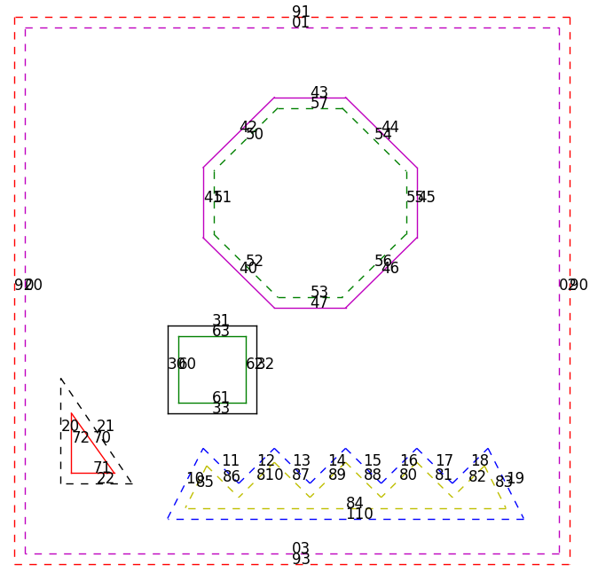

## Amigo robot


### 1. Introduction

Amigo is a 2D dry-wall cutting robot developed by [**KOBOTS ApS**](https://kobots.dk/). This project entails the optimization of the cutting task performed by the robot in the following aspects:
1. Order of cuts per shape
2. Order of visit of shapes
3. Automatic tool offset compensation
4. Visualization


### 2. Prerequisites
The project depends on two open-source libraries for shape clipping and plotting, which are:

* [**matplotlib-cpp**](https://github.com/lava/matplotlib-cpp): The simplest C++ plotting library. It is built to resemble the plotting API used by Matlab and matplotlib.
* [**Clipper!**](http://www.angusj.com/delphi/clipper.php): The Clipper library performs line & polygon clipping - intersection, union, difference & exclusive-or, and line & polygon offsetting.

**Note**: Python 2 needs to be available for the use of *matplotlibcpp*

### 3. Usage

First, clone the repository:  
`git clone https://gitlab.com/mabouseif/kobots_amigo.git`

A demo is available to show the different use cases, the automatic offsetting based on tool size, as well as the order of cuts and shapes.
To compile & run the demo:

```
g++ -std=c++11 ./include/clipper.cpp ./include/helper_functions.cpp -I/usr/include/python2.7 -lpython2.7 demo.cpp -o demo && ./demo
```
Demo result:
<p align="center">


For custom shapes and experimentation, user input shapes have to be manually entered as points in `demo.cpp`, since the UI is still not integrated.

### 4. Tests

Several tests (to be further extended) were developed for some cases, including memory leak check.

Memory leak tests were done using [**Valgrind**](https://valgrind.org/)

1. For running valgrind memory-leak and other checks (comment out plotting matplotlib-based plotting function from target test file):
```
cd src/
g++ -g ../include/helper_functions.cpp ../include/clipper.cpp stacked_horizontals_test.cpp -o stacked_horizontals_test -std=c++11 -I/usr/include/python2.7 -lpython2.7 && valgrind --leak-check=yes --track-origins=yes --dsymutil=yes ./stacked_horizontals_test
```

2. For the stacked board-wide polygon test:
```
cd src/
g++ ../include/helper_functions.cpp ../include/clipper.cpp stacked_horizontals_test.cpp -o stacked_horizontals_test -std=c++11 -I/usr/include/python2.7 -lpython2.7 && ./stacked_horizontals_test
```

3. For the polygon ordering test:
```
cd src/
g++ -std=c++11 ../include/clipper.cpp ../include/helper_functions.cpp -I/usr/include/python2.7 -lpython2.7 ordering_test.cpp -o ordering_test && ./ordering_test
```


### 5. Files

- [**helper_functions.h**](./include/helper_functions.h) and [**helper_functions.cpp**](./include/helper_functions.cpp):  
Majority of the functionality.

- [**clipper.hpp**](./include/clipper.hpp) and [**clipper.cpp**](./include/clipper.cpp):  
Clipper library.

- [**matplotlibcpp.h**](./include/matplotlibcpp.h):  
Matplotlib library.

- [**demo.cpp**](./demo.cpp):  
Demo and sandbox for experimention.


### 6. TODO

1. Direction of final line
2. Direction indicators for visualisation
3. Proper problem model for use of an optimization library
4. Fix .gitignore